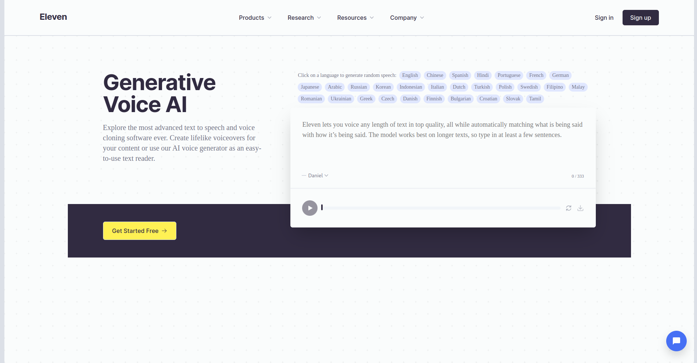

# Flx Chatbot




This project features a chatbot implemented in an ElevenLabs website(cloned). The front-end code for the ElevenLabs website has been created using website cloning techniques. However, the chatbot component, a core feature of this project, has been fully developed by me(Flenex.io) using a React library called react-simple-chatbot. This is just an initial state of the project and many more features will be added soon.

## Usage

To experience this chatbot in action, follow these steps:

1. Visit the live project where the chatbot is implemented.

2. The chatbot should be prominently displayed on the bottom right side of the website, ready to assist you with any questions or information you need.

3. Engage with the chatbot by typing your queries or responding to its prompts.

4. The chatbot will provide you with relevant answers and information based on your interactions.

## Development

If you wish to work on the development or customization of this chatbot, you can follow these steps:

1. Clone this repository

   ```bash
   git clone https://github.com/flenex-io/ChatBot.git
   ```

2. Navigate to the project directory:

   ```bash
   cd chatbot-elevenlabs

   ```

3. Install the necessary dependencies

   ```bash
   npm install

   ```

4. Run the project
   ```bash
   npm start
   ```
